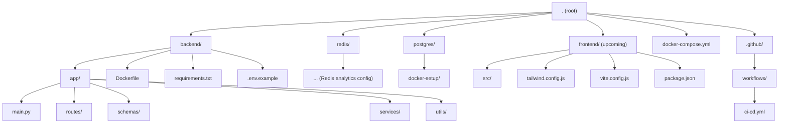

**URL‑Shortener with FastAPI, PostgreSQL & Redis Analytics 🚀**

**Overview**

A high‑performance URL shortener service built with FastAPI and PostgreSQL, engineered for <5 ms redirects, secure JWT‑based authentication, and Redis‑powered analytics capturing clickstream data (timestamps, geolocation) at scale (10K+ RPM).

The system is fully containerized with Docker, exposed via ngrok for public endpoints, and supports CI/CD through GitHub Actions, reducing deployment time by ~60%. A sleek React + Tailwind CSS frontend (bootstrapped with Vite) is in progress—optimized for fast load times thanks to code‑splitting and cached Axios calls.

  **Backend Architecture & Features**

1.FastAPI-powered backend with asynchronous endpoints, delivering ultra-fast performance.

2.PostgreSQL as the primary relational data store, accessed via an async ORM (e.g. SQLModel / async SQLAlchemy).

3.JWT authentication system enables secure user registration, login, and tracking of click behavior.

4.URL redirection latency <5 ms, measured end‑to‑end from request to redirect.

5.Redis-based analytics pipeline capturing clickstream events (timestamp, IP or geolocation, user agent, referrer), supporting 10K+ requests per minute.

 **DevOps & Deployment**

1.Dockerized services with individual Dockerfiles for backend, Redis, PostgreSQL, analytics.

2.Use of ngrok to expose local service tunnels for development and testing.

3.GitHub Actions CI/CD pipelines handle build, test, docker-compose deployment—cutting deployment time by up to 60%.

 **Frontend (In Development)**

1.A modern UI under construction with:

2.React + Vite for fast builds and development.

3.Tailwind CSS for utility-first styling.

4.Optimized for performance: code-splitting, caching, and responsive layouts.

5.Axios for API interaction with cached calls to reduce latency.

6.Aiming to reduce Largest Contentful Paint (LCP) by ~40% over a naïve setup.

**Usage**
**Backend (Developers)**

cd backend

pip install -r requirements.txt

uvicorn app.main:app --reload

Use the /docs or /redoc endpoints for OpenAPI interface—with endpoints for signup/login (JWT), create short URL, and redirect alias.

**Docker + ngrok**

docker-compose up --build

ngrok http http://localhost:8000

**CI/CD via GitHub Actions**

On each push to main, workflows run tests, lint, build containers, and deploy staging or production.

**Click Analytics**

1.Redis handles live ingestion of redirect events:

2.Each click event is enriched with timestamp and inferred geolocation.

3.Supports throughput of 10,000+ requests per minute with minimal latency overhead.

4.Analytics dashboard and aggregation queries supported (optional extension).

**Future Work (Roadmap)**

1.Frontend live preview—create/customize short links.

2.Click‑analytics dashboard UI (charts, filters).

3.Admin/user dashboards, password recovery flow.
